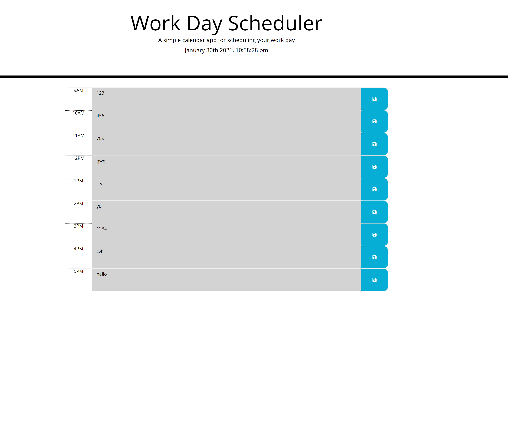

# du-work-day-scheduler

For this project I created a weekday scheduler that allowed a client to plan out their day. This will be perfect for planning out a busy business workday. It will display the time blocks 9am-5pm and the time blocks will be color coded for past, present, or future. In addition, the user will be able to add their events into each time block's text area and save it using a save button.

I started this project by working on the html since I knew I had to add the time blocks on there. This allowed me to work on one time block and getting it it display properly to the user. Once that one time block was done the rest were really easy to complete.

From there I began my JS file which continues to be difficult for me. The first function I created was getting the save button to save the users input into local storage. When I got that to work I was able to focus on getting the time blocks to change color according to the current time. 

Once I got all that to work I was able to go through and write my code to retrieve the user's input from the local storage and apply it to the appropriate time block. This is also where JS actually grabs the time and applies it to the update function.

In comparison jQuery is a bit easier to learn and in someways I believe jQuery helped me understand Javascript. I was able to get a better understanding of how we use elements from our html or css files and use them in the JS file. This project boosted my confidence and makes me excited to continue learning.

